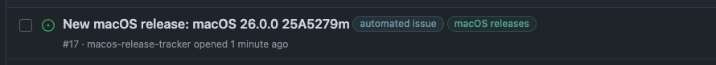
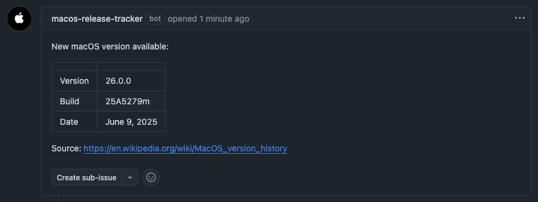

# macos-release-tracker

Automatically creates an issue when a new macOS version is available.




This is useful when certain actions need to performed by hand
whenever a new macOS version is released.
Uses the macOS version history Wikipedia page:
https://en.wikipedia.org/wiki/MacOS_version_history.
While not the fastest approach, it is certainly reliable.

## Installation

In your repository where you want to track releases:

```
mkdir -p .github/workflows
cd .github/workflows
git submodule add https://github.com/ungive/github-macos-release-tracker.git macos-release-tracker
cp macos-release-tracker/workflow.example.yml macos-release-tracker.yml
```

Adjust the environment variables to your needs.
Make sure the issue labels exist in the repository,
otherwise they will not be added to created issues.

Commit and push and you're done!

## LICENSE

This repository is licensed under the MIT License.
See [LICENSE](./LICENSE) for details.

Copyright (c) 2025 Jonas van den Berg
